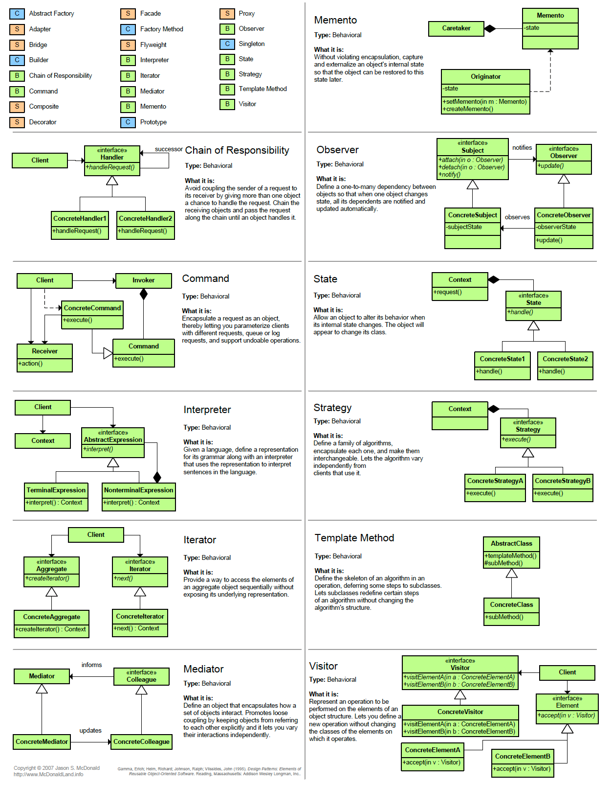

# design_patterns
Want to spread the word of a clean code. Decided to share some references to easy to learn design patterns sources 

1. Alex Xu's cheast sheet diagram

 

2. https://refactoring.guru/design-patterns/catalog for more details.